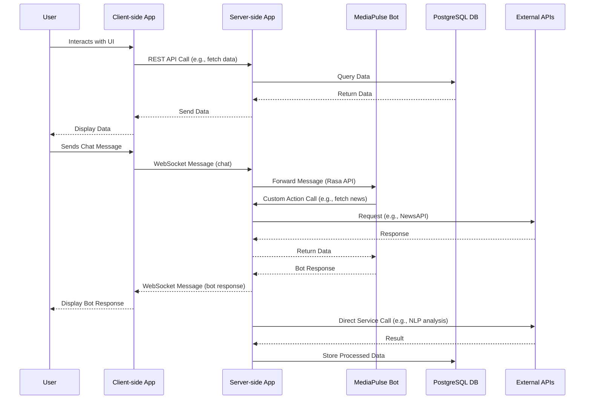
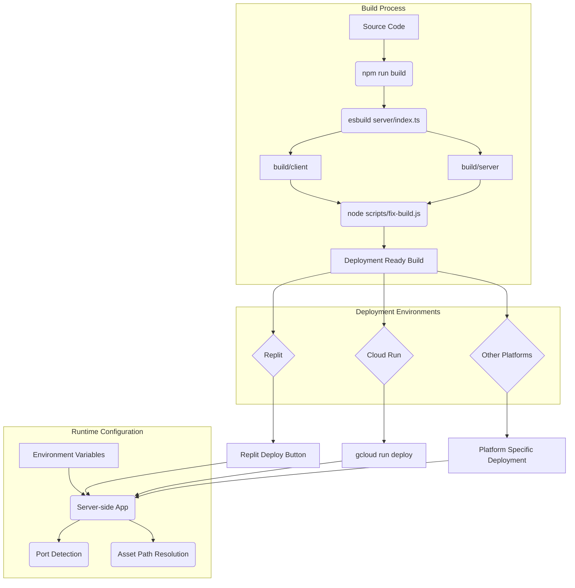

# MediaPulse MVP Architectural Blueprint

## 1. High-Level Structure

The MediaPulse MVP application is designed with a modular, component-based architecture, separating concerns into distinct services and layers. This approach enhances maintainability, scalability, and independent deployment.

```mermaid
graph TD
    A[Client-side Application] -->|REST API, WebSockets| B(Server-side Application)
    B -->|HTTP/S| C(External APIs)
    B -->|Database Queries| D[PostgreSQL Database]
    B -->|HTTP/S (Rasa API)| E(MediaPulse Bot)
    E -->|Custom Actions| B
    F[Shared Components] --> A
    F --> B
    G[Scripts]
    H[Tests]
```

## 2. Key Components and Interdependencies

### 2.1. Client-side Application (`client/`)
A React-based Single-Page Application (SPA) providing the user interface.
*   **Key Technologies**: React, TypeScript, Tailwind CSS, Vite.
*   **Core Components**:
    *   [`client/src/EnhancedApp.tsx`](client/src/EnhancedApp.tsx): Main entry point, handles global contexts and routing.
    *   [`client/src/contexts/`](client/src/contexts/): Manages global state (e.g., accessibility).
    *   [`client/public/`](client/public/): Static assets.
*   **Interdependencies**: Communicates with the Server-side Application via REST API calls and WebSockets.

### 2.2. Server-side Application (`server/`)
A Node.js (Express) backend serving as the central hub for business logic, data management, and service orchestration.
*   **Key Technologies**: Node.js, Express.js, TypeScript, Drizzle ORM, WebSockets (`ws`).
*   **Core Components**:
    *   [`server/index.ts`](server/index.ts): Main Express server entry point.
    *   [`server/routes.ts`](server/routes.ts): Defines API endpoints and maps to controllers.
    *   [`server/db.ts`](server/db.ts): Manages PostgreSQL database connections and queries using Drizzle ORM.
    *   [`server/config.ts`](server/config.ts): Handles application configurations and environment variables.
    *   [`server/controllers/`](server/controllers/): Contains logic for specific API requests (e.g., `chat-controller.ts`, `nlp-controller.ts`, `trend-controller.ts`).
    *   [`server/services/`](server/services/): Encapsulates business logic and external API integrations (e.g., `openai-service.ts`, `news-service.ts`, `serpapi-service.ts`, `rasa-service.ts`, `anthropic.ts`, `arabert-service.ts`, `email.ts`, `data-integration-service.ts`, `context-hint-service.ts`, `report-export-service.ts`, `spacy-service.ts`, `startup-service.ts`, `trend-analysis-service.ts`).
    *   [`server/middleware/`](server/middleware/): Provides Express middleware for error handling (`errorHandling.ts`) and security (`security.ts`).
    *   [`server/websocket-manager.ts`](server/websocket-manager.ts): Manages WebSocket connections and real-time data flow.
*   **Interdependencies**: Interacts with the PostgreSQL database, MediaPulse Bot, and various External APIs. Serves the Client-side Application.

### 2.3. MediaPulse Bot (`media_pulse_bot/`)
A Rasa-based conversational AI bot for natural language processing and interaction.
*   **Key Technologies**: Rasa (NLU, Core), Python.
*   **Core Components**:
    *   [`media_pulse_bot/domain.yml`](media_pulse_bot/domain.yml): Defines bot's domain (intents, entities, slots, responses).
    *   [`media_pulse_bot/data/`](media_pulse_bot/data/): Contains NLU training data (`nlu.yml`), stories (`stories.yml`), and rules (`rules.yml`).
    *   [`media_pulse_bot/actions/actions.py`](media_pulse_bot/actions/actions.py): Custom actions that can interact with the Node.js backend services.
    *   [`media_pulse_bot/config.yml`](media_pulse_bot/config.yml): Rasa pipeline configuration.
    *   [`media_pulse_bot/endpoints.yml`](media_pulse_bot/endpoints.yml): Configuration for connecting to external services (e.g., custom actions server).
*   **Interdependencies**: Communicates with the Server-side Application (Node.js) for processing user input and executing custom actions.

### 2.4. Shared Components (`shared/`)
Contains code shared between client and server to ensure consistency.
*   **Key Components**:
    *   [`shared/schema.ts`](shared/schema.ts): Defines shared data structures and types (e.g., Drizzle schemas).
*   **Interdependencies**: Used by both Client-side and Server-side Applications.

### 2.5. Scripts (`scripts/`)
A collection of utility scripts for development and maintenance.
*   **Examples**: Database seeding (`run-seed.ts`), translation management (`extract-translations.ts`), build fixes (`fix-build.js`).

### 2.6. Tests (`tests/`)
Comprehensive test suite for unit, integration, and end-to-end testing.
*   **Structure**: `tests/backend/`, `tests/frontend/`, `tests/integration/`, `tests/__mocks__/`.

## 3. Data Flow



## 4. Persistence Mechanisms

The application uses a PostgreSQL database for persistent data storage.
*   **ORM**: Drizzle ORM is used for type-safe database interactions.
*   **Configuration**: Database connection string is managed via the `DATABASE_URL` environment variable.
*   **Schema**: Defined in `shared/schema.ts` and managed with `drizzle-kit`.

## 5. Deployment Strategy

The application supports deployment on Replit, Google Cloud Run, and other custom environments.



*   **Build Process**:
    *   `npm run build`: Compiles client-side assets with Vite and server-side TypeScript with Esbuild into `build/client` and `build/server` respectively.
    *   `node scripts/fix-build.js`: Adjusts directory structure for proper static file serving in production.
*   **Multi-Environment Support**:
    *   **Replit**: Uses port 5000, detects `REPL_ID` env var.
    *   **Cloud Run**: Uses port 8080, detects `K_SERVICE` env var.
    *   **Local/Custom**: Adapts based on `PORT` env var, falls back to defaults.
*   **Environment Variables**: Critical for configuration (e.g., `NODE_ENV`, `PORT`, `DATABASE_URL`, `OPENAI_API_KEY`, `GOOGLE_API_KEY`, `AWS_ACCESS_KEY_ID`, `AWS_SECRET_ACCESS_KEY`).
*   **Asset Path Resolution**: The server intelligently locates static assets by checking multiple paths (`build/client`, `build/server/public`, `dist/public`, `public`, `client`).
*   **Continuous Deployment**: Integrates with GitHub (Replit), Cloud Build triggers (Cloud Run), or custom CI/CD pipelines.

## 6. Security Considerations

Security is addressed at multiple layers:
*   **Middleware**: `server/middleware/security.ts` likely implements common security practices (e.g., CORS, helmet for HTTP headers).
*   **Authentication/Authorization**: Implied by `server/auth.ts` and `passport` dependencies, suggesting user authentication and session management.
*   **Environment Variables**: Sensitive information (API keys, database credentials) are stored as environment variables, not hardcoded.
*   **Input Validation**: `zod` and `drizzle-zod` are used for schema validation, ensuring data integrity and preventing common injection attacks.
*   **Dependency Management**: `npm audit` is used for security auditing of dependencies.
*   **HTTPS**: `HTTPS_SETUP.md` indicates support for secure communication.

## 7. Scalability and Performance

The architecture supports scalability and performance through:
*   **Component Separation**: Independent client, server, and bot components allow for separate scaling.
*   **Node.js Event Loop**: The non-blocking I/O model of Node.js is well-suited for handling concurrent connections, especially for real-time features.
*   **WebSockets**: Efficient for real-time communication, reducing overhead compared to frequent polling.
*   **Database**: PostgreSQL is a robust and scalable relational database. Drizzle ORM provides efficient query generation.
*   **External Services**: Offloading heavy NLP and AI computations to external services (OpenAI, Google Cloud, AWS Comprehend) prevents the server from becoming a bottleneck.
*   **Caching**: `memoizee` dependency suggests caching mechanisms are in place to improve performance of frequently accessed data or expensive computations.
*   **Load Balancing**: For production deployments like Cloud Run, load balancing is handled automatically by the platform.

## 8. AI Bot Deep Dive (MediaPulse Bot)

The MediaPulse Bot, built with Rasa, provides conversational AI capabilities.
*   **Natural Language Understanding (NLU)**: Processes user input to extract intents and entities using `nlu.yml` training data.
*   **Dialogue Management (Core)**: Manages conversation flow based on `stories.yml` and `rules.yml`.
*   **Custom Actions**: `actions/actions.py` defines custom logic that the bot executes. These actions often make HTTP requests back to the Node.js server's services (e.g., to fetch news, perform sentiment analysis). This allows the bot to leverage the backend's data and external API integrations.
*   **Integration with Server**: The Node.js server acts as an intermediary, forwarding user messages to the Rasa bot and receiving responses. The `server/rasa-service.ts` handles this communication.

## 9. Data Integration Services Deep Dive (`server/services/`)

The `server/services/` directory is crucial for integrating with various internal and external data sources and AI models.
*   **`openai-service.ts` / `anthropic.ts`**: Integrates with large language models for advanced NLP tasks, content generation, or complex query understanding.
*   **`news-service.ts`**: Likely integrates with NewsAPI or similar services to fetch real-time news data.
*   **`serpapi-service.ts`**: Integrates with SerpAPI for structured search results from various search engines.
*   **`data-integration-service.ts`**: A general service for integrating diverse data sources, potentially including social media platforms or other content feeds.
*   **`nlp-service.ts`**: Orchestrates various NLP functionalities, potentially leveraging Google Cloud Language (`@google-cloud/language`), AWS Comprehend (`@aws-sdk/client-comprehend`), or local NLP libraries (`spacy-service.ts`, `arabert-service.ts`). This service centralizes text processing, sentiment analysis, entity recognition, etc.
*   **`trend-analysis-service.ts`**: Processes and analyzes data to identify trends, likely using data from news, social media, and other integrated sources.
*   **`email.ts`**: Handles email notifications, possibly for alerts or reports.
*   **`report-export-service.ts`**: Manages the generation and export of reports (e.g., PDF, Excel using `jspdf`, `xlsx`).